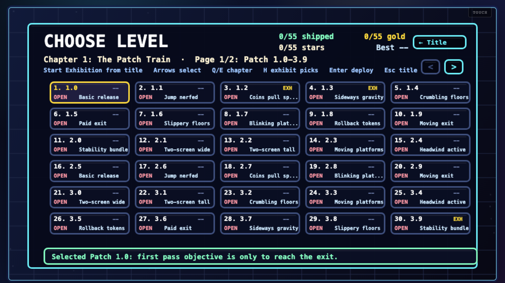
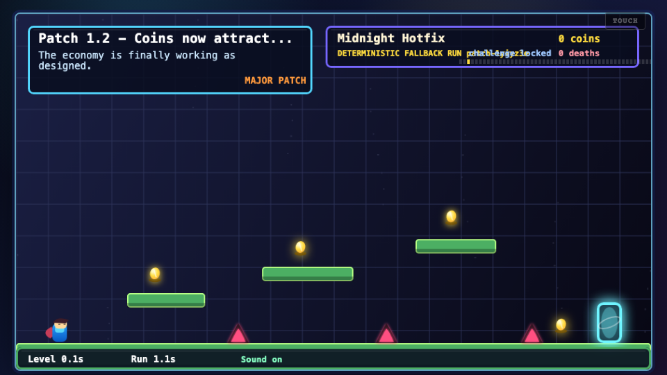
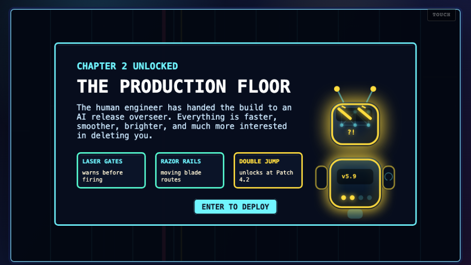

# Judge Guide: Escape the Patch Notes

**Playable link:** https://escape-the-patch-notes.vercel.app  
**Public repo:** https://github.com/Caleb-Todd-commits/Escape-The-Patch-Notes  
**Short pitch:** a browser platformer slowly ruined by its own updates.

Escape the Patch Notes is a 50-level Vite + TypeScript + Canvas platformer built entirely with Codex. Chapter 1 (Patches 1.0–3.4) starts as a normal coin-and-exit platformer, then the updates arrive: jump height gets nerfed, coins attract spikes, gravity rotates, platforms crumble, exits charge fees, and the final stability patches stack previous mistakes together. Chapter 2 (Patches 3.5–5.9) moves into The Production Floor — a faster neon tech gauntlet with conveyors, laser gates, razor rails, crushers, tesla arcs, sensors, plasma vents, an unlockable double jump, and an AI release overseer replacing the human engineer.

## Recommended 5-Minute Judging Path

1. Open the playable link.
2. Click **Start Exhibition** on the title screen.
3. Play the seven curated patches. They show the core joke, mechanical variety, Chapter 2, double jump, and the finale.
4. Press `B` to open Choose Level and inspect both chapter pages.
5. Jump directly to Patch `5.9` (level 50) via Settings → Jump to Level for the hardest Production Floor finale.
6. Replay any cleared level to see its Challenge Patch objective and star.

## Screenshots

| Title screen | Exhibition intro |
|---|---|
|  |  |

| Chapter 1 — all 25 patches cleared | Chapter 2 — Production Floor board |
|---|---|
|  |  |

| Double jump unlock (Patch 3.7) | Production Floor finale (Patch 5.9) |
|---|---|
|  |  |

| Win screen — Grade S, all 50 patches | Exhibition complete report |
|---|---|
|  |  |

## Exhibition Route

The in-game **Start Exhibition** button plays these seven patches in order:

| Patch | Level | Screenshot | Why It Matters |
|---|---:|---|---|
| `1.2` | 3 |  | Coins attract spikes — the first "bad update" joke with real mechanical consequences. |
| `1.3` | 4 |  | Gravity rotates sideways, showing the game can completely change rules without changing controls. |
| `3.4` | 25 |  | Chapter 1 finale — bundles all previous broken mechanics into one stability patch. |
| `3.7` | 28 |  | Double jump unlock, bridging Chapter 1 and the Production Floor's faster movement. |
| `4.4` | 35 |  | First Production Floor finale with lasers, razors, crushers, plasma vents, and moving exits. |
| `5.3` | 44 |  | Compact all-hazard gauntlet — every Chapter 2 hazard type in one level. |
| `5.9` | 50 |  | True finale — three conveyors, every hazard, fee of 10 coins, rollback tokens on the floor. |

## Controls

| Action | Keys |
|---|---|
| Move | `A/D` or `←/→` arrows |
| Jump | `Space`, `W`, or `↑` arrow |
| Double jump | Press jump again in the air (Chapter 2 only) |
| Restart level | `R` |
| Pause | `Esc` |
| Mute | `M` |
| Choose Level | `B` |
| Settings | `S` from title or pause |
| Exhibition shortcut | `H` on the title screen |
| Switch chapter page | `Q / E` on Choose Level |
| Deploy selected patch | `Enter` or `Space` on Choose Level |

## Replay Challenges

First clear of each level: just reach the exit. After a level is cleared, replaying it unlocks a Challenge Patch objective displayed on the patch intro card.

- **Chapter 1:** usually collect a hidden bug report before reaching the exit.
- **Chapter 2:** arcade goals — all coins, beat par time, avoid sensors, skip rollback tokens, no double jump, or a master objective combining all of the above.

Challenge clears earn a star. Stars, medals, and best times are all tracked per level on the Choose Level board and the final release report.

## AI Integration

The OpenAI Responses API generates run flavor via Structured Outputs:

- Run title and build name
- Per-level patch-note headline, copy, and severity label
- Engineer / AI overseer commentary (devLines) for each patch
- Death quips (deathLines) referencing the specific hazard that killed the player
- Finale recap and game-over summary

The AI never generates collision boxes, level layouts, physics values, hazard positions, score rules, or win/loss conditions. All gameplay is deterministic and fully playable with the fallback copy when the API is unavailable. No API keys, tokens, or secrets are committed to the repo.

## What to Look For

- The first few patches teach the core joke quickly: every update makes the game measurably worse in a readable way.
- Chapter 2 shifts the scenario completely — neon production-floor visuals, new hazard classes with clear warning states, and a non-human AI overseer with four distinct moods.
- The AI overseer reacts to context: confident on the title, worried on the chapter intro, proud on level complete, exhausted after multiple deaths.
- Exhibition gives judges the best material without requiring a full 50-level clear.
- Choose Level and Settings → Jump to Level mean judging is never blocked by progression — any level is one keypress away.
- The final release report grades the full run (S → SHIP?) and lists every patch medal, time, and challenge star.
