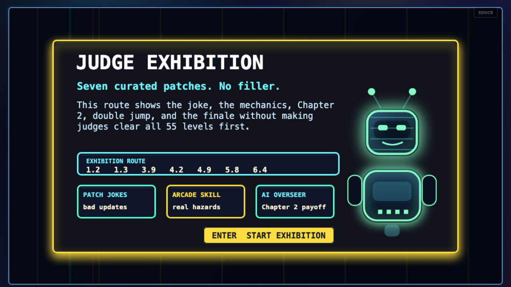
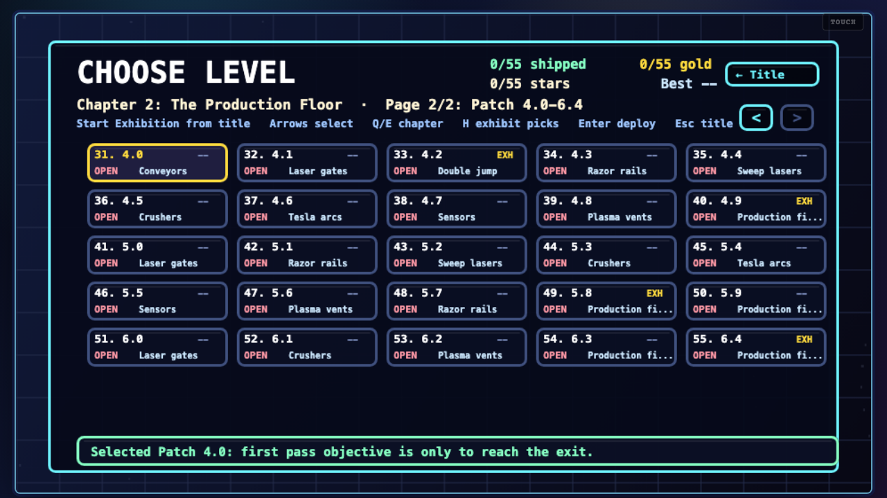
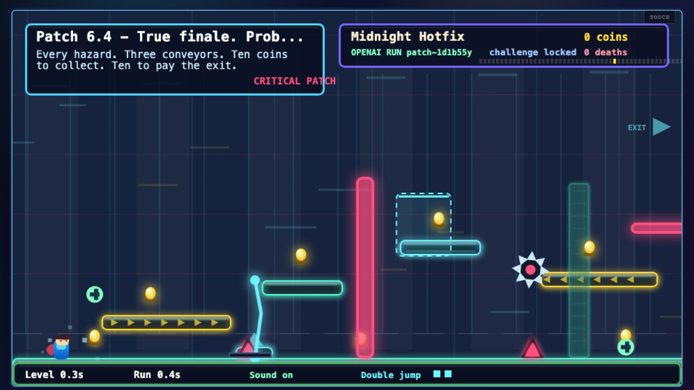
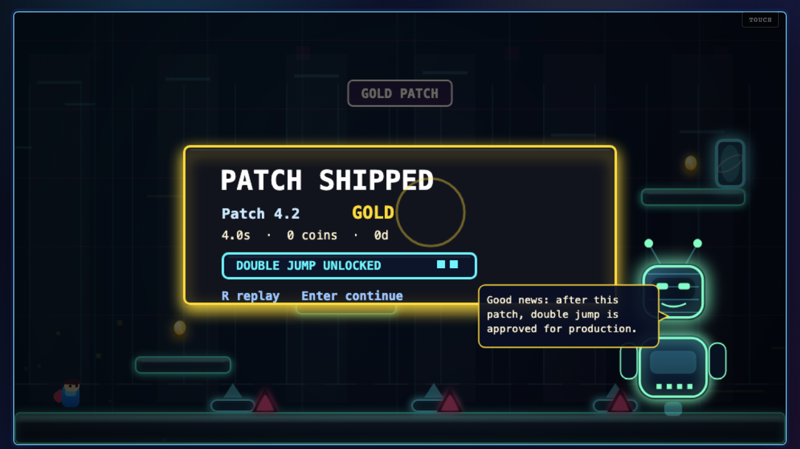
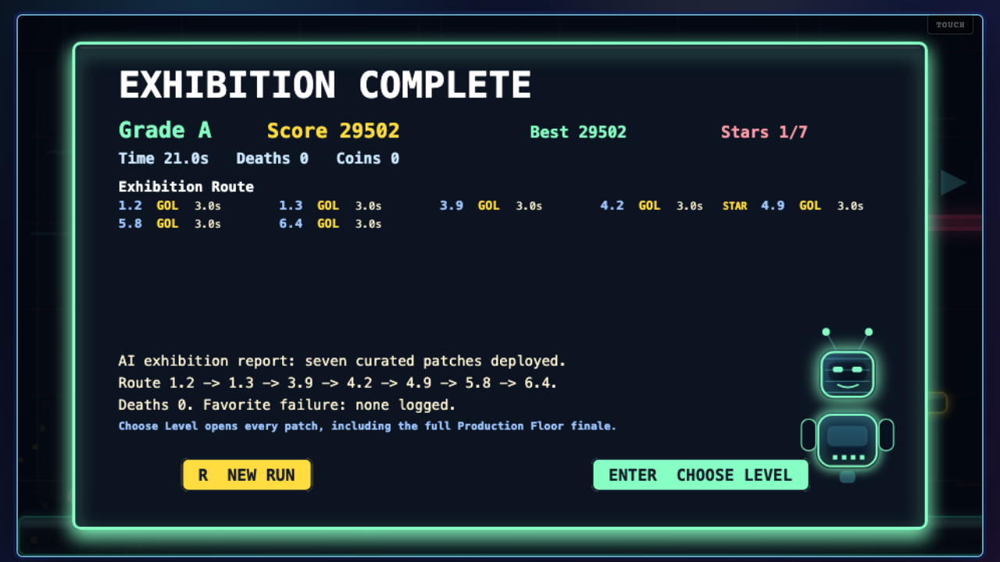

# Judge Guide: Escape the Patch Notes

**Playable link:** https://escape-the-patch-notes.vercel.app  
**Public repo:** https://github.com/Caleb-Todd-commits/Escape-The-Patch-Notes  
**Short pitch:** a browser platformer slowly ruined by its own updates.

Escape the Patch Notes is a 55-level Vite + TypeScript + Canvas platformer. Chapter 1 starts as a broken patch-note comedy game: jump height gets nerfed, coins attract spikes, gravity rotates, platforms crumble, exits charge fees, and the final stability patches stack previous mistakes together. Chapter 2 moves into The Production Floor, a faster neon tech gauntlet with lasers, razors, crushers, sensors, plasma vents, conveyors, double jump, and an AI release overseer replacing the human engineer.

## Recommended 5-Minute Judging Path

1. Open the playable link.
2. Click **Start Exhibition** on the title screen.
3. Play the seven curated patches. They show the core joke, the mechanical variety, Chapter 2, double jump, and the finale.
4. Press `B` or choose **Choose Level** to inspect both chapter pages.
5. Go to Chapter 2 and jump to Patch `6.4` if you want the hardest Production Floor finale immediately.
6. Replay any cleared level to see its Challenge Patch objective and star.

## Photos / Screenshots

| Title | Exhibition Intro |
|---|---|
|  |  |

| Choose Level | Production Finale |
|---|---|
|  |  |

| Double Jump Unlock | Exhibition Report |
|---|---|
|  |  |

## Exhibition Route

The in-game **Start Exhibition** button plays these patches in order:

| Patch | Level | Screenshot | Why It Matters |
|---|---:|---|---|
| `1.2` | 3 | [gameplay](public/screenshots/exhibition-level-1-2.png) | Coins attract spikes. This is the first clear "bad update" joke with real mechanical consequences. |
| `1.3` | 4 | [route](public/screenshots/exhibition-intro.png) | Gravity rotates sideways, showing the game can change rules dramatically without changing controls. |
| `3.9` | 30 | [route](public/screenshots/exhibition-intro.png) | Chapter 1 finale. It bundles earlier broken mechanics into a more chaotic stability patch. |
| `4.2` | 33 | [unlock](public/screenshots/exhibition-double-jump.png) | Double jump unlock. This is the cleanest bridge into Chapter 2's faster movement. |
| `4.9` | 40 | [choose level](public/screenshots/choose-level-judge-route.png) | First Production Floor finale with modern hazards and double-jump routing. |
| `5.8` | 49 | [choose level](public/screenshots/choose-level-judge-route.png) | Compressed hazard showcase with conveyors, lasers, razors, crushers, jump pads, coins, and fee pressure. |
| `6.4` | 55 | [finale](public/screenshots/exhibition-production-finale.png) | True Production Floor finale with every major hazard family online. |

## Controls

- Move: `A/D` or left/right arrows
- Jump: `Space`, `W`, or up arrow
- Double jump: press jump again in the air after it unlocks in Chapter 2
- Restart level: `R`
- Pause: `Esc`
- Mute: `M`
- Choose Level: `B`
- Settings: `S` from title or pause
- Exhibition shortcut: `H` on the title screen
- Choose Level chapter page: `Q/E`
- Choose Level deploy selected patch: `Enter` or `Space`

## Replay Challenges

The first time you beat a level, the objective is simple: reach the exit. After that level is cleared, replaying it unlocks a Challenge Patch objective. Chapter 1 usually asks for a hidden bug report. Chapter 2 uses arcade goals such as all coins, par time, no sensors, no rollback, no double jump, or master finale objectives. A clear gives a checkmark; a challenge clear gives a star.

## AI and Fallback

The OpenAI API is used only for run flavor: run title, patch-note copy, severity labels, jokes, engineer/AI commentary, death quips, and final recap. It never generates collision boxes, level layouts, physics, hazards, score rules, or win/loss rules.

The game is fully playable without an API key. If the serverless API is unavailable, the game uses a deterministic fallback run and shows that positively as a fallback build. No API keys, tokens, secrets, or `.env` files are committed.

## What To Look For

- The first few patches teach the joke quickly: every update makes the game worse in a readable way.
- Chapter 2 changes the scenario completely with smoother neon production-floor visuals and a non-human AI overseer.
- Exhibition mode gives judges the best material without requiring a full 55-level clear.
- Choose Level lets you jump anywhere, including the finale, so judging never gets blocked by progression.
- Replay challenges add depth without hiding the main game behind completion gates.
