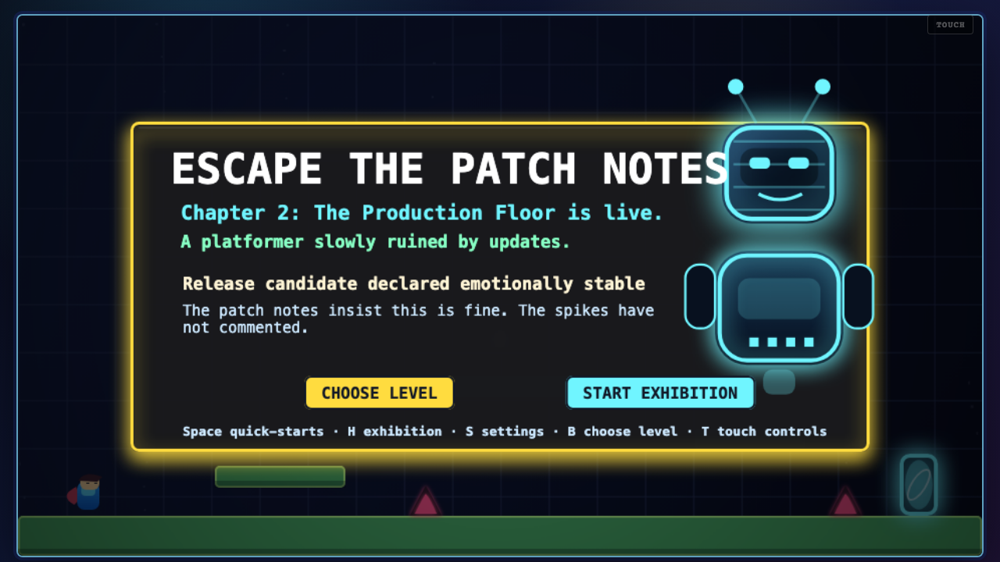
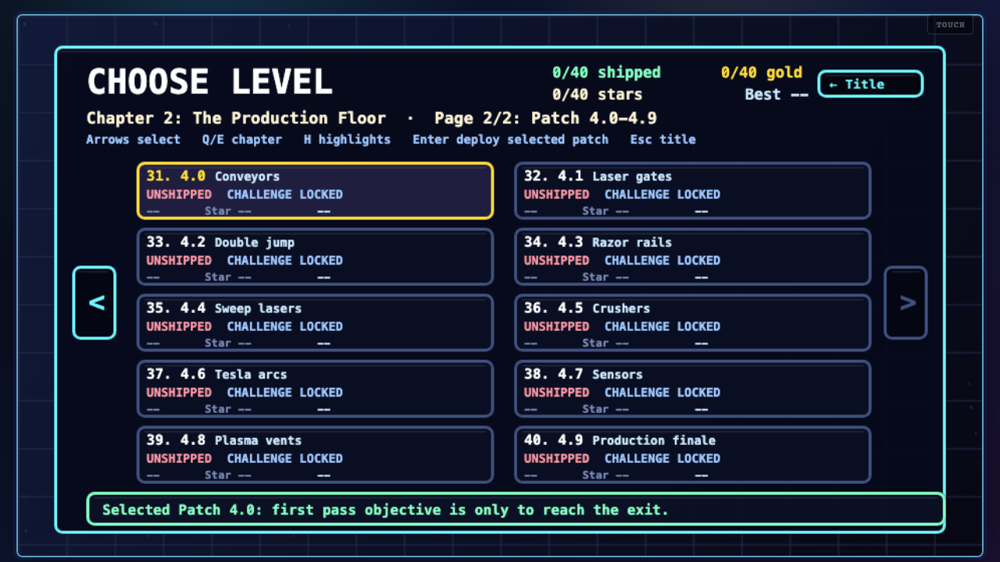
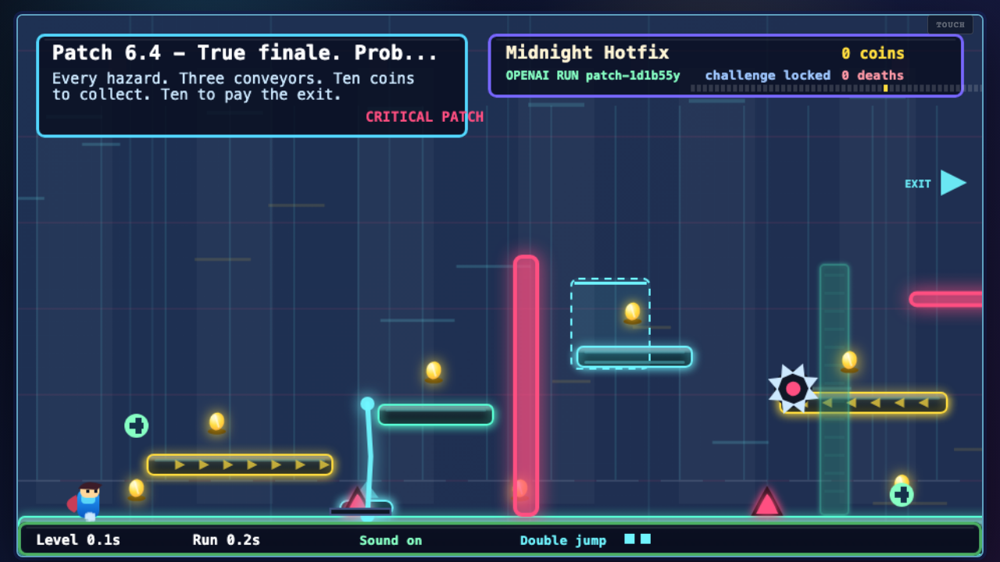
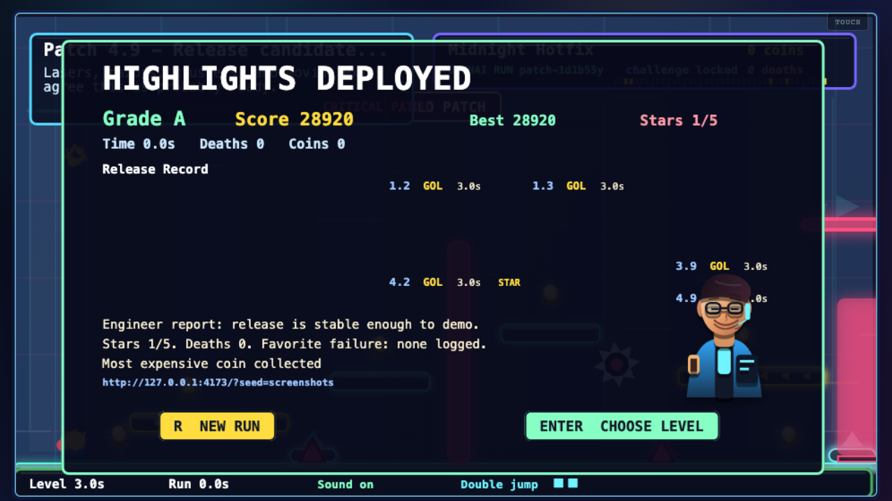

# Escape the Patch Notes

**A platformer slowly ruined by updates.**

**Play now: https://escape-the-patch-notes.vercel.app**

**Judge guide:** [JUDGES.md](JUDGES.md) has screenshots, a 5-minute walkthrough, and the best levels to play.

Escape the Patch Notes is a browser platformer where every level introduces a new suspicious patch note. The first chapter starts like a normal coin-and-exit platformer, then the updates arrive: jump height gets nerfed, coins attract spikes, gravity rotates, platforms crumble, exits charge fees, and final stability bundles stack the previous mistakes together. Chapter 2 moves into **The Production Floor**, a 25-level modern tech gauntlet with conveyors, lasers, razors, crushers, tesla arcs, sensors, plasma vents, an unlockable double jump, and an AI release overseer replacing the human engineer.

## Screenshots

| Title | Choose Level |
|---|---|
|  |  |

| Production Floor | Release Report |
|---|---|
|  |  |

## What I Made

- A playable Vite + TypeScript + Canvas game with 50 short levels: 25 Chapter 1 patches (Patch 1.0–3.4) plus 25 Chapter 2 Production Floor patches (Patch 3.5–5.9).
- Deterministic platformer physics, fixed level layouts, restarts, pause, two-page Choose Level screen, win screen, scoring, medals, persistent progress, and shareable run seeds.
- A judge-first **Start Exhibition** route that plays seven curated patches in order, so the best jokes and mechanics are visible in the first few minutes.
- Chiptune background music (Web Audio lookahead scheduler), pitch-shifted intro sounds per patch, particle bursts, and screen shake for each meaningful event.
- Release-train progress indicator in the HUD showing all 50 patches by medal color as you advance.
- Per-level patch completion cards with time, coins, deaths, medal, and challenge-star status at a glance.
- Full release report on the win screen: all 50 level medals, time, deaths, coins, challenge stars, and recap prompts.
- Two-page Choose Level screen: all 25 Chapter 1 levels on page one and all 25 Chapter 2 levels on page two, with visible forward/back arrows.
- **Settings → Jump to Level**: inline ← [N] → picker that launches any of the 50 levels instantly. Intended for judges who want to skip straight to the hardest or flashiest patches.
- **Start Exhibition** button on the title screen and `H` shortcut on the Choose Level screen to jump between standout levels quickly.
- Completion-gated replay challenges: once you beat a level, replaying unlocks an extra Challenge Patch goal such as filing a bug report, collecting every coin, beating par time, avoiding sensors, skipping rollback, or mastering a finale route.
- Chapter 2 double jump unlock: beat Patch 3.7 (level 28) normally to unlock double jump for the Production Floor; jumping directly to Patch 3.8+ enables it automatically for judges.
- Chapter 2 AI character: the human engineer gives way to a glowing AI release overseer on Production Floor intros, patch cards, deaths, clears, and final reports.
- Game-feel polish: coyote time, jump buffering, variable jump height, smoother camera lead, landing particles, double-jump trails, glowing portals, smoother spikes, and clearer hazard warning states.
- A Vercel serverless API route at `POST /api/run` that uses the OpenAI Responses API to generate funny run-specific patch-note flavor via Structured Outputs.
- A safe deterministic fallback run, so the game is fully playable without an API key.

## Best Levels for Judges

The fastest path is the **Start Exhibition** button on the title screen. The full judge walkthrough with screenshots is in [JUDGES.md](JUDGES.md). Exhibition plays:

- Patch `1.2` — coins attract spikes.
- Patch `1.3` — gravity rotates sideways.
- Patch `3.4` — Chapter 1 finale: stability bundle stacks every previous broken mechanic.
- Patch `3.7` — Production Floor double-jump unlock.
- Patch `4.4` — Production Floor mid-point finale.
- Patch `5.3` — compact all-hazard gauntlet.
- Patch `5.9` — true Production Floor finale with every hazard family online.

For direct access, press `B` for Choose Level or use **Settings → Jump to Level**. Chapter 2 is page two of Choose Level.

## How Codex Helped

Codex was used throughout the build to rapidly prototype, iterate, and finish the game:

- **Architecture decisions** — Codex proposed keeping all gameplay state (physics, levels, win/loss) deterministic and local, with AI touching only flavor copy. This made the game testable and fair regardless of API availability.
- **Game loop and physics** — Codex implemented the canvas render loop, AABB collision with per-axis resolution, modifier system (crumbling platforms, spike magnet, async platforms, rollback tokens), and the gravity-rotation mechanic.
- **Level design and tuning** — All 50 level layouts, coin placements, hazards, and challenge objectives were generated and tuned by Codex based on playtest feedback (shorter target times, clearer paths, more judge-friendly Exhibition picks).
- **OpenAI integration** — Codex wrote the `/api/run` Vercel serverless function using the Responses API with a JSON Schema for Structured Outputs, the sanitizer that falls back gracefully on any bad output, and the seed-based run-ID system for shareable links.
- **Tests** — Codex wrote the full Vitest unit suite (physics, scoring, progress, run sanitizer, level tuning) and the Playwright end-to-end sweep across all 50 levels including replay-challenge paths.
- **Polish** — Chiptune music, release-train HUD, Chapter 2 tech visuals, double-jump indicator, win-screen layout, medal grid for all 50 levels, per-patch transition sounds, and particle variations were all implemented or refined with Codex.

## How to Play

- Move: `A/D` or left/right arrows
- Jump: `Space`, `W`, or up arrow
- Double jump: press jump again in the air after it unlocks in Chapter 2
- Restart level: `R`
- Pause: `Esc`
- Mute: `M`
- Settings: `S` from title or pause
- Choose Level: `B`
- Choose Level select: arrow keys
- Choose Level previous/next chapter: `Q/E` or the on-screen arrows
- Choose Level deploy selected patch: `Enter` or `Space`
- Start Exhibition: title screen button or `H` on the title screen

Collect coins, dodge spikes, and reach the exit. Some exits charge a coin fee. Rollback tokens briefly suppress the current patch effect.

Choose Level is split into two chapter pages. Page one shows all 25 Chapter 1 patches at once, and page two shows all 25 Chapter 2 Production Floor patches in a compact 5x5 grid. It shows every patch, whether it has been cleared, whether the replay challenge is unlocked, the best medal, challenge-star state, and best time. Settings also includes a Jump to Level option so judges can jump directly to any level.

The first time you play a level, the objective is simple: reach the exit and ship the patch. Once you successfully complete that level, replaying it unlocks a Challenge Patch. Chapter 1 challenges usually ask you to file a hidden bug report. Chapter 2 challenges ask for more arcade goals: all coins, par time, no sensors, no rollback, or master finale objectives. Challenge stars and fast, clean clears earn better medals. The final screen grades the full run and stores your best score locally.

## Run Locally

```bash
npm install
npm run dev
```

Open the local URL printed by Vite.

## OpenAI API Setup

The game works without the OpenAI API. To enable AI-generated run flavor on Vercel, add these environment variables in Vercel project settings:

```bash
OPENAI_API_KEY=your_server_side_key
OPENAI_MODEL=gpt-4.1-mini
```

Do not commit real `.env` files, API keys, tokens, or secrets. The `.gitignore` already excludes `.env`.

The AI route uses the Responses API with Structured Outputs (JSON Schema). The schema contains **only flavor fields** — headline, patch note, joke, severity label, finale recap, and game-over summary. The AI cannot touch collision boxes, physics values, level layouts, win/loss rules, player modifiers, or coin placements. Any malformed AI output falls back to the deterministic copy silently.

## Tests

```bash
npm test
npm run build
npm run test:browser
```

The browser test suite smoke-tests Choose Level, checks the Exhibition route and Chapter 2 unlock flow, captures README/judge screenshots, and runs a full normal-clear plus replay-challenge sweep across all 50 patches.

## Submission Blurb

- **Public repo:** https://github.com/Caleb-Todd-commits/Escape-The-Patch-Notes
- **Playable link:** https://escape-the-patch-notes.vercel.app
- **Short description:** A browser platformer slowly ruined by its own updates.

**Escape the Patch Notes** is a browser platformer slowly ruined by its own updates. Across 50 levels, each patch ships a new suspicious rule or remix: jump height nerfed for balance, coins now attract spikes, gravity rotated 90 degrees, platforms have a durability budget, exits charge fees, worlds expand, platforms move, wind pushes back, and Chapter 2 escalates into a 25-level Production Floor full of conveyors, lasers, razors, crushers, sensors, plasma vents, an unlockable double jump, and an AI release overseer who replaces the human engineer. Beat a level once to ship the patch; replay it to earn its Challenge Patch star. Judges can use Start Exhibition, Choose Level, or Settings > Jump to Level to skip directly to the most interesting patches. Finish the run and get a full release report graded from SHIP? to S.

The OpenAI Responses API generates the run's flavor — patch-note copy, severity labels, jokes, finale recap — via Structured Outputs. All gameplay is deterministic and fully playable with the fallback copy when no API key is present. The entire game was designed and built with Codex.
